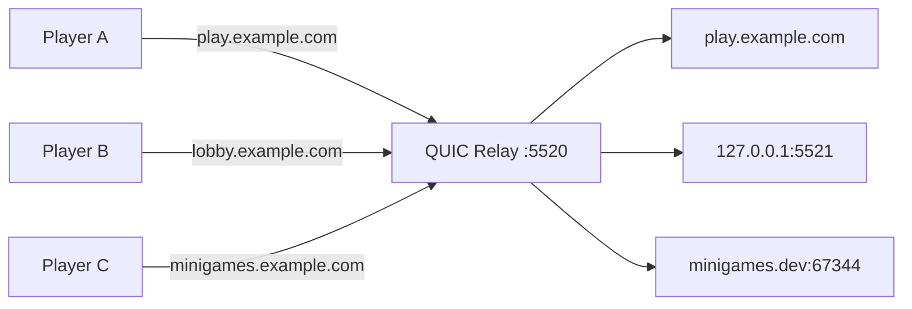

<p align="center">
  
</p>


# QUIC Relay

[](https://github.com/HyBuildNet/quic-relay/actions/workflows/ci.yml)

A QUIC reverse proxy for Hytale servers. Routes connections by domain (SNI) and supports optional TLS termination for protocol inspection and manipulation.

Since Hytale lacks SRV record support ([source](https://support.hytale.com/hc/en-us/articles/45326769420827-Hytale-Server-Manual#:~:text=ecosystem-,SRV,exists)), this proxy enables multiple servers on a single IP and port.



## Quickstart

```bash
curl -sSL https://raw.githubusercontent.com/HyBuildNet/quic-relay/master/dist/install.sh | sudo bash
sudo systemctl enable --now quic-relay
```

Configure via `/etc/quic-relay/config.json`. Reload with `systemctl reload quic-relay`.

### Docker

```bash
docker run -p 5520:5520/udp ghcr.io/hybuildnet/quic-relay:latest
```

```bash
podman run -p 5520:5520/udp ghcr.io/hybuildnet/quic-relay:latest
```

Or mount your config:
```bash
docker run -p 5520:5520/udp -v /path/to/config.json:/data/config.json ghcr.io/hybuildnet/quic-relay:latest
```

> **Note:** If your backend servers are on an internal network, ensure the container has network access (e.g., `--network host` or connect to the appropriate Docker network).

## Handlers

Handlers form a chain. Each handler processes the connection and either passes it to the next handler (`Continue`), handles it (`Handled`), or drops it (`Drop`).
Custom handlers can be implemented quite easily, but the project needs to be recompiled.

### SNI Router (Domain-based Routing)

Routes connections based on the domain (SNI) players connect to.

```json
{
  "listen": ":5520",
  "handlers": [
    {
      "type": "sni-router",
      "config": {
        "routes": {
          "play.example.com": "10.0.0.1:5520",
          "lobby.example.com": "10.0.0.2:5521",
          "minigames.example.com": "myserver.internal.dev:8000"
        }
      }
    },
    {
      "type": "forwarder"
    }
  ]
}
```

> **Note:** The `forwarder` handler contains the actual forwarding logic. This separation allows replacing it with a [terminating proxy](#tls-termination) for protocol inspection/manipulation.

### Simple Router

Routes all connections to a single backend.

```json
{
  "listen": ":5520",
  "handlers": [
    {
      "type": "ratelimit-global",
      "config": {
        "max_parallel_connections": 10000
      }
    },
    {
      "type": "simple-router",
      "config": {
        "backend": "10.0.0.1:5527"
      }
    },
    {
      "type": "forwarder"
    }
  ]
}
```

### Rate Limiter

Limits the total number of concurrent connections. New connections are dropped when the limit is reached.

### Forwarder

Forwards packets to the backend. Must be the last handler in the chain.

### Log SNI

Logs the SNI of each connection. Useful for debugging.

```json
{
  "listen": ":5520",
  "handlers": [
    {
      "type": "logsni"
    },
    {
      "type": "sni-router",
      "config": {
        "routes": {
          "play.example.com": "10.0.0.1:5521"
        }
      }
    },
    {
      "type": "forwarder"
    }
  ]
}
```

## Advanced

### Load Balancing

Both `sni-router` and `simple-router` support round-robin load balancing. Use an array of backends instead of a single address:

```json
{
  "type": "sni-router",
  "config": {
    "routes": {
      "play.example.com": ["10.0.0.1:5520", "10.0.0.2:5520", "[2001:db8::1]:5520"]
    }
  }
}
```

For `simple-router`, use `backends` (array) instead of `backend` (string).

### TLS Termination

The `terminator` handler terminates QUIC TLS and bridges to backend servers for protocol inspection.

> **Note:** Requires the [HytaleCustomCert](https://hybuildnet.github.io/HytaleCustomCert/) plugin on backend servers or another workflow to extract the /tmp certs at every runtime.

See [docs/tls-termination.md](docs/tls-termination.md) for configuration.

### Global Config Options

```json
{
  "listen": ":5520",
  "session_timeout": 600,
  "allow_connection_migration": false,
  "handlers": [...]
}
```

- `session_timeout` - Idle session timeout in seconds (default: `7200` = 2 hours). Sessions without traffic are cleaned up after this duration. Can be changed via hot-reload (SIGHUP).
- `allow_connection_migration` - Whether established sessions may rebind to a new client IP/port (default: `false`). Enable only if you need live-session NAT rebinding / path changes and accept the weaker security posture.

### Environment Variables

Fallback when not set in config:
- `QUIC_RELAY_LISTEN` - Listen address (default: `:5520`)
- `QUIC_RELAY_BACKEND` - Backend address for `simple-router`

## Build

```bash
make build
```

Produces `bin/proxy`.

## License

MIT License. See [LICENSE](LICENSE) for details.

*This project is neither related to nor affiliated with HYPIXEL STUDIOS CANADA INC. or any other Trademark owner of Hytale.*
